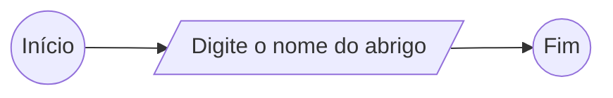
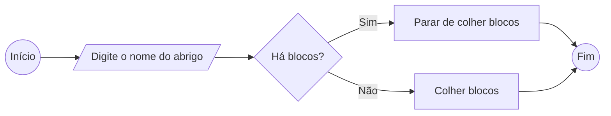
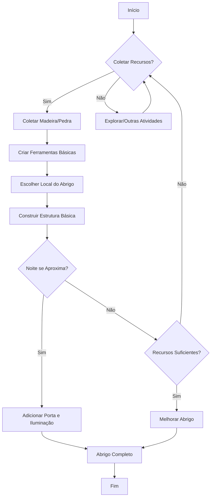
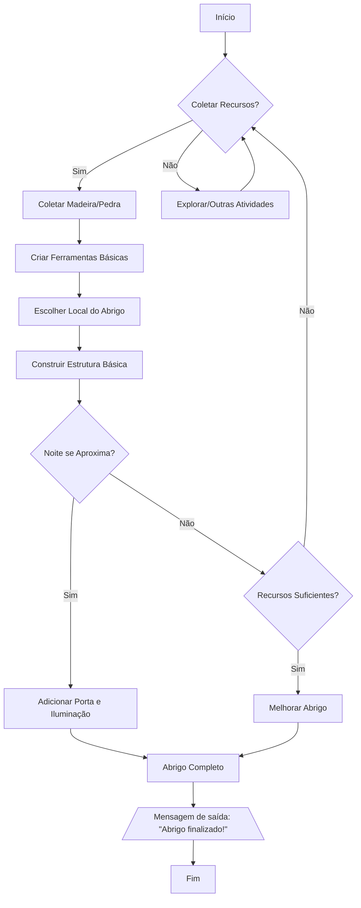

# Entendendo Algoritmos e Fluxogramas

## A base de tudo

### Para que serve lógica

### Para quem é esse conteúdo

- A **lógica** é como você organiza seu pensamento computacional, enquanto que a linguagem é meramente uma sintaxe.
  - Posso pedir "água" em diferentes países — "water" no Estados Unidos, por exemplo — mas a estrutura sintática para isso é praticamente a mesma.

### A primeira coisa que você precisa aprender para se tornar dev

- Para passar **instruções** a uma máquina, você precisa primeiro conhecer essas instruções.
- A melhor maneira de estruturar seu pensamento lógico é através de **algoritmos**.

## Sobre algoritmos

### A base sobre algoritmos

- Lógica de programação nada mais é do que _estruturar_ seu **pensamento** de maneira lógica para _escrever_ **algoritmos**.
  - Algoritmos é o passo a passo lógico para resolver um **problema**.
    - 📍 Identificação do problema

### Algoritmos no seu dia a dia

- Há uma **ordem lógica** de ações a serem realizadas para resolver um problema.
  - Exemplo: assar um pão:
    ```mermaid
    flowchart TB
        Início
        --> B@{ shape: rect, label: "Abrir forno" }
        --> C@{ shape: diam, label: "Forno aceso" }
        C --> | Sim | D@{ shape: rect, label: "Botar lenha" }
        C --> | Não | E@{ shape: rect, label: "Acender fogo" }
        D --> F@{ shape: rect, label: "Assar pão" }
        E --> F
        --> Fim
    ```

## Fluxogramas

### O que são fluxogramas

- Se um algoritmo é uma sequência lógica para resolver um problema, então como exprimi-los? Uma das formas é através de fluxogramas.
  - Um **fluxograma** é uma representação visual de uma sequência de ações lógicas.
- **Exercício:** Nossos heróis precisam criar um abrigo para construir um lugar seguro para se proteger das noites perigosas. Desenhe um algoritmo para resolver esse problema.

### Estrutura início e fim de fluxo

- Todo fluxograma começa e termina com caixas arredondadas chamadas "Início" e "Fim"
  ```mermaid
  flowchart LR
      A((Início)) --> B((Fim))
  ```

### Estrutura de entrada de dados

O nó de um fluxograma que representa uma entrada de dados é um **paralelogramo**:



### Estruturas de decisão e ação

Uma decisão é representada por um **losango**, e, uma ação, por um **retângulo**:



### Estrutura de looping



### Estrutura de saída

Imagine que queiramos exibir uma mensagem para o usuário quando o abrigo for finalizado, para isso usaríamos um nó de saída, representado por um **trapezoide**:



### Por que estudar mais fluxos?

## Materiais de Apoio

- [Material do curso](https://helpful-jump-17b.notion.site/Mapa-de-aventura-91f3e9bd923842149d4dba754dc65c07?p=fd3cb94523b142d08b983d456e94668c&pm=c)
